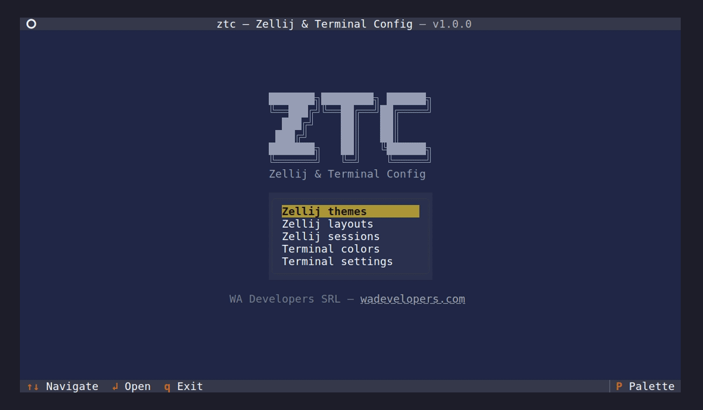

# ZTC — Zellij & Terminal Config

TUI for managing your terminal setup: Alacritty/Kitty colors and
settings plus Zellij themes, layouts and sessions. All from a single
interface, without having to remember TOML/KDL/conf syntax.



## Installation

```bash
uv tool install git+https://github.com/wadevelopers/ztc
```

This installs two commands on your `PATH`:

- **`ztc`**: full app with menu access to all features.
- **`zsm`**: quick session launcher — equivalent to opening `ztc` and
  going straight to "Zellij sessions". Useful as a replacement for the
  pre-Zellij shell prompt.

> A PyPI release is planned for v1.1.0 (under the package name
> `ztc-tui`). See [`doc/ROADMAP.md`](doc/ROADMAP.md).

### Requirements

- Python 3.11+
- Alacritty or Kitty (for color and settings editing).
- Zellij (optional). Without Zellij, the Zellij menu items appear
  disabled.
- `fontconfig` (`fc-list`) — optional. Enables the visual font picker
  in Terminal settings; without it, `font.family` falls back to a
  free-text input.

## Features

The main `ztc` menu exposes five modules:

- **Zellij themes** — pick or edit the active Zellij theme. Custom
  themes can be created and edited slot by slot, both in the legacy
  ANSI palette and in the rich UI slots.
- **Zellij layouts** — visual layout editor: tab/pane tree, splits,
  margins, borders, names and plugin configuration.
- **Zellij sessions** — list, attach, create, rename and delete
  sessions. Also exposed as a standalone CLI (`zsm`).
- **Terminal colors** — editor for the 16 ANSI colors plus the special
  slots (foreground, background, cursor) of the active backend.
  Contrast warnings are computed against the active Zellij theme
  background.
- **Terminal settings** — six values: padding x, padding y, opacity,
  font family, font size and cursor shape. The same six work on both
  backends; each is serialized to its native format (TOML for
  Alacritty, flat key/value for Kitty).

General navigation: `↑↓` to move, `↲` to open, `Esc` to go back, `q`
to quit (only from the main menu — inside editors `q` is a no-op so it
cannot be pressed accidentally).

## Automatic terminal detection

The app detects which terminal launched it by reading env vars that
survive multiplexers like Zellij and tmux:

| Backend | Marker |
|---|---|
| Alacritty | `ALACRITTY_WINDOW_ID` or `ALACRITTY_SOCKET` |
| Kitty | `KITTY_PID`, `KITTY_WINDOW_ID`, or `TERM=xterm-kitty` |

If the host terminal is unsupported (gnome-terminal, etc.), the
Terminal colors and Terminal settings entries are disabled with the
note `(unsupported)`. Zellij features remain available as long as
Zellij is installed.

### Override

```bash
TERM_CONFIG_TUI_BACKEND=alacritty ztc
TERM_CONFIG_TUI_BACKEND=kitty ztc
TERM_CONFIG_TUI_BACKEND=auto ztc    # default: auto-detect
```

If `SSH_CONNECTION` is set, color and settings editing are disabled
because the local client config file is not accessible from the remote
host.

## Editing colors in Kitty with `include`

If your `kitty.conf` includes a theme file (e.g.
`include themes/tokyonight.conf`), the app reads the effective colors
by expanding the include. When you modify a color from the editor:

1. The new line is added at the end of your main `kitty.conf`.
2. Kitty applies "last-occurrence-wins", so the new line takes
   precedence over the include.
3. The theme file itself is **not modified** — it stays intact.
4. If you later switch the include to a different theme, the colors
   you edited still take precedence. To restore a slot to the theme
   value, press `x` (Reset slot) in the editor: that removes the line
   from the main config so the include wins again.

Limitation: only direct `include` is expanded. `globinclude` and
`envinclude` are not. Nested includes are supported up to depth 5.

## How `zsm` launches Zellij

`zsm` (and the embedded launcher inside `ztc`) use `os.execvp` to
**replace** their own process with Zellij when you choose attach/new/
bash — they do not run Zellij as a child:

```
shell (PID 100)
  └─ zsm (PID 200)         ← TUI running
       │ you pick "attach my-session"
       │ os.execvp("zellij", "attach", "my-session")
       ↓
shell (PID 100)
  └─ zellij (PID 200)      ← SAME PID, different program
```

`zsm` consumes no memory while you are inside Zellij — it has been
literally replaced by Zellij.

**Limitation**: attaching to a session and creating a new session
require that the launching process is **not** already inside a Zellij
session. That is a Zellij restriction, not the launcher's. The primary
use case for `zsm` is to run it from the shell before entering
Zellij.

## Multi-terminal architecture

Backends today: Alacritty (TOML) and Kitty (flat key/value). The
abstraction lives in `src/ztc/services/terminals/`: implementing the
`TerminalBackend` interface for a new terminal (e.g. Ghostty, WezTerm,
Foot) integrates it without touching the rest of the code. Fork
contributions are welcome — see [`doc/ROADMAP.md`](doc/ROADMAP.md).

## Development

```bash
git clone https://github.com/wadevelopers/ztc
cd ztc
uv venv
uv pip install -e ".[dev]"
uv run ztc       # full app
uv run zsm       # session launcher
uv run pytest
```

## License

[MIT](LICENSE) — © 2026 WA Developers SRL.
